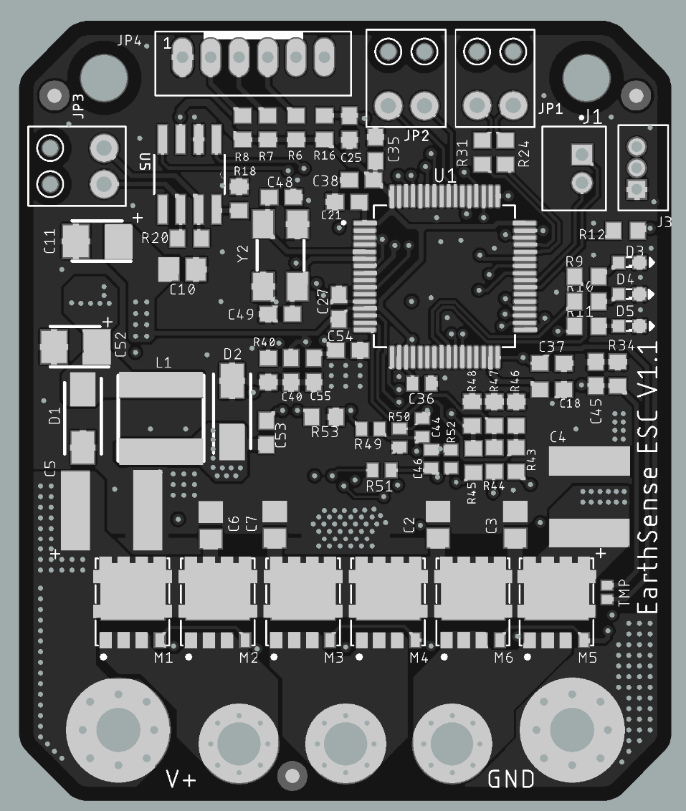
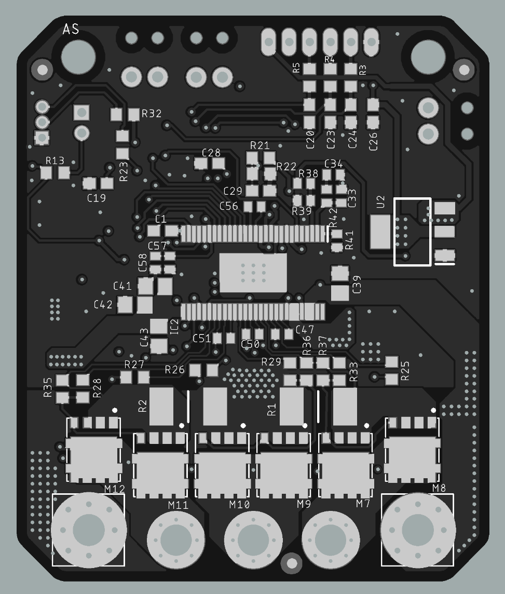

# ES-ESC-HW
Hardware source files for EarthSense ESC Based on VESC4

## Modifications from VESC4 Hardware:
* Changed form factor to fit onto EarthSense TerraSentia System Board
* Two IO Pins are broken out for auto-setting CAN ID based on placement on EarthSense TerraSentia System Board
* MOSFETs changed to flat 5x6 packages (STL260N)
* Changed various components in 5v regulator and 3.3v regulator circuits
* Removed IO pins that are not useful to EarthSense TerraSentia Robots
* SWD Programming header broken out to JST-ZH connector
* Two DIO broken out to JST-PH Connector for reading quadrature encoders
